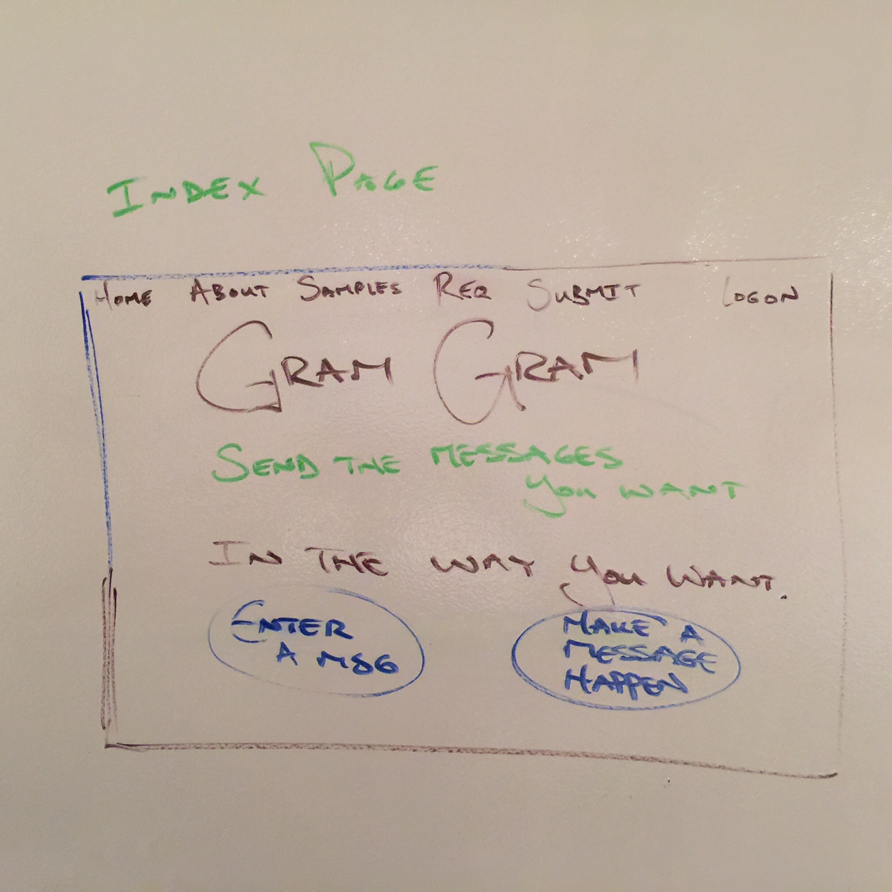
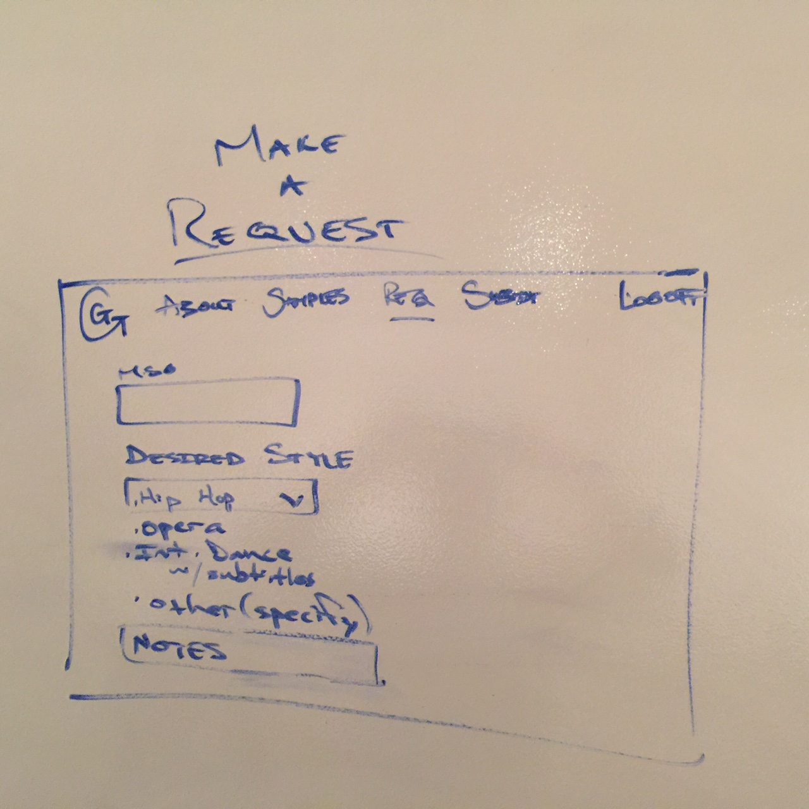
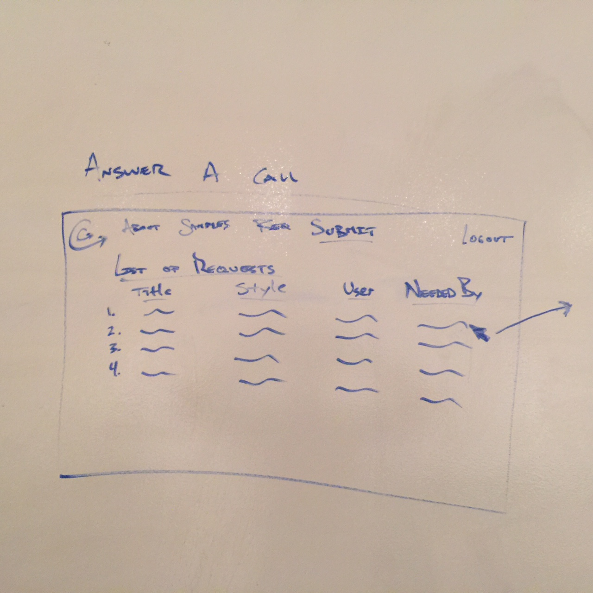
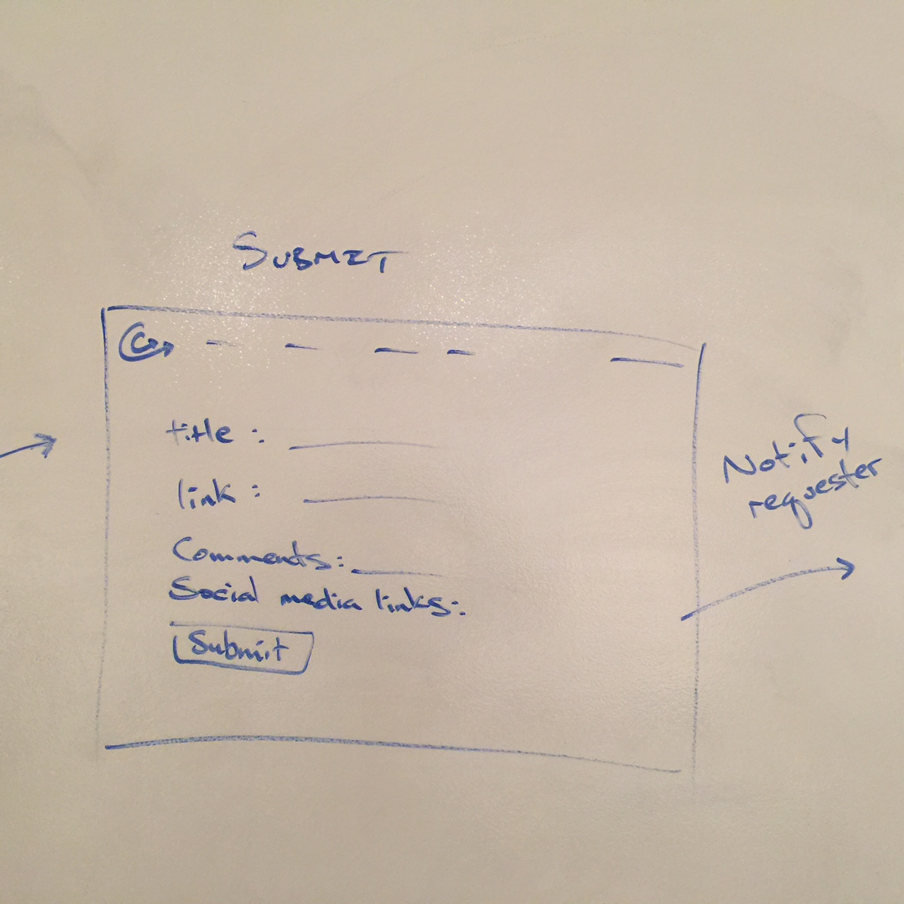
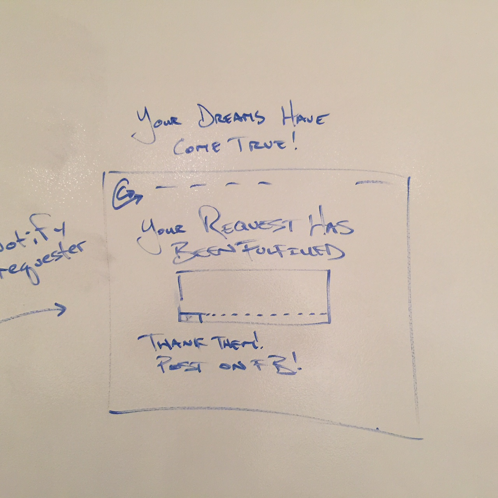

# GramGram

Look around you.  Singing telegrams have gone the way of the buffalo. People favor looking at their phones rather than making real world gestures to show each other they care.  Bring your letters to life with the digital miracle known as Gram Gram.  Talented strangers will take your words and perform them in the style that you choose for free (for now) so you can get your message to the person intended in the WAY you want it to be said.  No more emoticons.  No more long nights tossing and turning imagining "what if I had been able to..." NO.  Regret is for the regretters. Make your dreams a reality with the newest craze that's sweeping the nation.  The One - the only - the resurgence of the singing telegram for the digital age - GRAM GRAM.

###Wireframes

###ERD

###Screenshot:

###Explanations of the technologies and concepts used:
Javascript, AngularJS, MongoDB, NodeJS, Express, Bootstrap, HTML5, CSS, Electricity, Angular Auth with Jwts, Central Air, ng-youtube-embed.

For video, used: https://github.com/brandly/angular-youtube-embed

###General Approach Taken:
The intent of GramGram is to be a SPA using the MEAN stack to which enables users to compose a message which they would like someone else to realize in a specified song format.  In order to accomplish this, any user wishing to generate a message or to submit a realized version of another user's message must Sign in, which generates a token which is valid for 7 days. They can then move around the site and compose at submit to their heart's content.

In order to submit a video response to the site, users must create a youtube account and as of now will compose their video in Youtube, after the completion of which they will provide a link to their video to be uploaded to the site.

###Installation instructions for a potential employer to clone down and run your app locally.
Clone this repo and install locally.  Node modules will not be included, so make sure to npm install and create your own .env file where your token secret will live (necessary if you want to use the application as written with angular token authorization).

###Unsolved problems/major hurdles overcome:
Working with Jwts was a challenge and proved to be more time consuming than hoped, but at the same time not the boogie monster it's reputation would dictate.  Locating a video uploading API proved a tad too time consuming for the project sprint, and in some cases unfeasible for the 1-week project sprint (e.g. Approval to use Vimeo's API takes up to 5 business days).  Achieving full flow across the site required creating and solving many problems, but in the end we have a site that accomplishes the goal and is (hopefully) fun, easy to use and fosters creative expression.

###A table of your routes with their auth requirements:
BE - Models -> Controllers -> config
FE - Routes -> services/factories -> controllers -> templates

    **Route**          **Needs Auth?**     
# | Route | Needs Auth
:-- | :-- | :--
1 | Route 1 | yes
2 | Route 2 | no                            
3 | Route   | no                            
4 | Route   | no                           
5 | Route   | yes             

###Trello link:
User stories up the wazoo, complete with Wireframes and ERDs: https://trello.com/b/5lzakbjQ/project-4

###Github links:
We're already here!

Link to the back end of this app: https://github.com/danieltotherescue/GramGram-backend

Link to the front end of this app: https://github.com/danieltotherescue/GramGram-frontend
